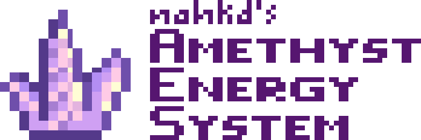
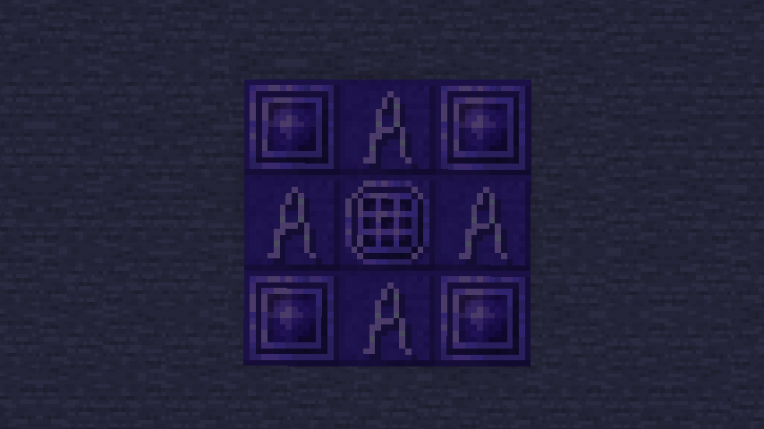

---

# Amethyst Energy System
_(Not to be confused with symmetrical encryption algorithm)_

Amethyst Energy System is a mod that provides more usage for amethyst shards, which doesn't have much use in vanilla gameplay (other than Spyglass).

## Download and install AES
> **Note**: You need [Fabric Loader 0.14.21+](https://fabricmc.net/use/installer/) for Minecraft 1.20.1 and [Fabric API 0.83.0+](https://modrinth.com/mod/fabric-api).

Development version of AES is available for download [here](https://github.com/nahkd123/amethyst-energy-system/actions). Simply click on the top one, scroll down to "Artifacts" section and download "Artifacts". After that, extract artifacts and copy ``amethyst-energy-system.jar`` (not the one with ``-sources``!) to your ``mods/`` folder.

## Quick start
> **Tip**: It's a good idea to install a mod that help you view recipes, like [JustEnoughItems](https://modrinth.com/mod/jei) for example.

Craft amethyst tools by surround iron tools with 8x Amethyst Shards. Then make 1x Amethyst Workbench, 4x Condensed Amethyst Blocks and 4x Amethyst Glyph Blocks. After that, create a multiblocks structure like below:

_(sorry for dark image)_

Open the workbench by... well... clicking on Amethyst Workbench. You'll be able to add modules, recharge your tools and upgrades them.

> **Note**: You need to have **at least** 1 Amethyst Shard present in your workbench in order to add/replace/remove your module.

> **Note**: Some modules may get destroyed when you remove/replace them.

## TODOs
- [ ] Module texture overlay thingy.
